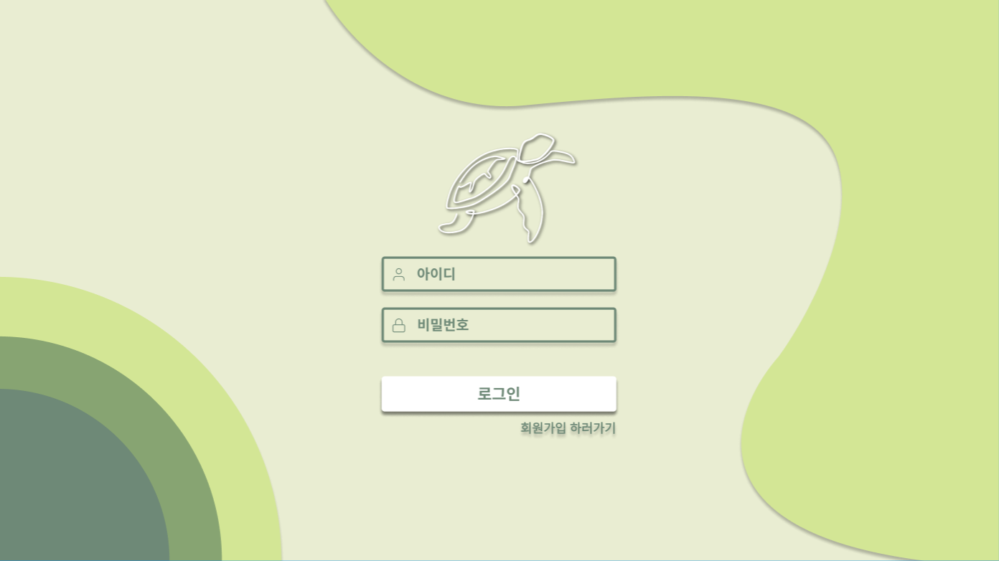

# 앱이름
## 🚀 슬로건
💡 당신의 A+을 위한 동영상 강의 AI 학습 도우미

## 👩‍💻👨‍💻 개발 팀원
- 서해린 : KAIST 전산학부 22학번
- 최우정 : KAIST 화학과 21학번

## ⚙️ 개발 환경
FE: javascript, CSS, figma
BE: Django, MySQL

## ℹ️ 애플리케이션 설명
## 주요 기능
- 자세 교정을 도와주는 서비스입니다.
- 'mediapipe' 라이브러리를 이용하여 별 다른 장치 없이 웹캠만으로 사용자의 자세 정보를 정확하게 추출합니다.
- 사용자에 따른 바른 자세 정보를 추출하여 데이터베이스에 저장합니다.
- '거북목, 화면 밀착, 틀어짐'의 세 가지 자세를 판단합니다.
- 바르지 못한 자세를 취할 경우 화면에 경고 메시지와 경고음을 통해 알려줍니다.
- PIP 기능을 통해 실시간으로 자신의 자세를 웹캠 화면에서 확인할 수 있습니다.
- 설정에서 웹캠 화면의 모습과 기록되는 자세를 자유롭게 변경할 수 있으며, 해당 정보를 데이터베이스에 저장합니다.
- 캐릭터 모드에서는 사용자의 자세에 따라 화면에 그림이 나타나며, 거북목 자세 시 머리 부분이 거북이 그림으로 바뀝니다.
- 노트북 사용 시간과 바르지 못한 자세를 취한 시간 및 횟수를 기록하여 데이터베이스에 저장합니다.
- 저장된 정보는 사용자와 날짜별로 그래프 형태로 시각화하여 제공합니다.

## 1 로그인

### 1.1 주요 기능
로그인을 하지 않았을 때 사이트를 둘러 볼 수 있습니다.
