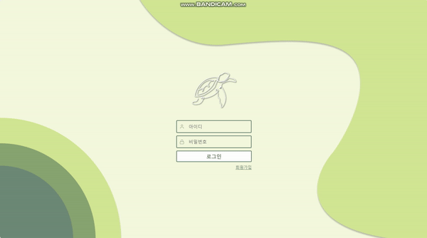
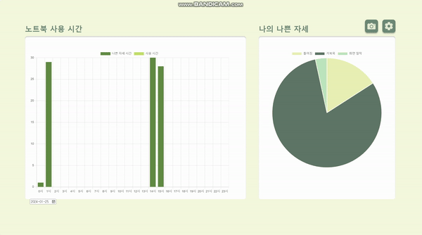
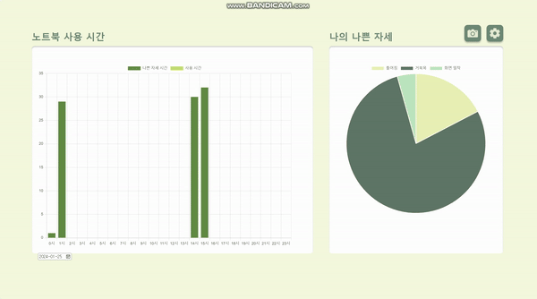
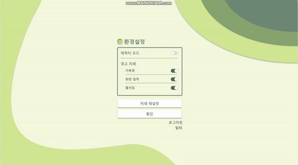

# CURVE: Code Upright, Refine Vertebrae Everyday
## 💡 노트북 할 때 바른 자세를 유지시켜주는 크롬 익스텐션 앱
 
## 👩‍💻👨‍💻 개발 팀원
- 서해린 : KAIST 전산학부 22학번
- 최우정 : KAIST 화학과 21학번
  
## ⚙️ 개발 환경
FE: Vanilla JS 
BE: Express, MySQL
  
## ℹ️ 서비스 설명
## 주요 기능
- 자세 교정을 도와주는 서비스입니다.
- 'mediapipe' 라이브러리를 이용하여 별 다른 장치 없이 웹캠만으로 사용자의 자세 정보를 정확하게 추출합니다.
- 사용자에 따른 바른 자세 정보를 추출하여 데이터베이스에 저장합니다.
- '거북목, 화면 밀착, 틀어짐'의 세 가지 자세를 판단합니다.
- 바르지 못한 자세를 취할 경우 화면에 경고 메시지와 경고음을 통해 알려줍니다.
- PIP 기능을 통해 실시간으로 자신의 자세를 웹캠 화면에서 확인할 수 있습니다.
- 설정에서 웹캠 화면의 모습과 기록되는 자세를 자유롭게 변경할 수 있으며, 해당 정보를 데이터베이스에 저장합니다.
- 캐릭터 모드에서는 사용자의 자세에 따라 화면에 그림이 나타나며, 거북목 자세 시 머리 부분이 거북이 그림으로 바뀝니다.
- 노트북 사용 시간과 바르지 못한 자세를 취한 시간 및 횟수를 기록하여 데이터베이스에 저장합니다.
- 저장된 정보는 사용자와 날짜별로 그래프 형태로 시각화하여 제공합니다.
 

## 1 로그인

### 1.1 주요 기능
- 통계 확인 및 환경 설정과 같이 로그인을 필요로 하는 기능의 경우, 로그인 창으로 이동합니다.
- 존재하지 않는 아이디거나, 비밀번호가 일치하지 않을 경우 toast 메시지를 통해 해당 내용을 알려줍니다.
- 성공적으로 로그인시, toast 메시지 출력과 함께 통계 화면으로 넘어가게 됩니다.

### 1.2 기술 설명
- 추후 내용 추가
 

## 2 통계 화면/차트

### 2.1 주요 기능
- 데이터베이스에 저장된 정보를 사용자와 날짜별로 그래프 형태로 시각화하여 제공합니다.
- 노트북 사용 시간과 바르지 못한 자세 시간은 막대 그래프로, 자세별 경고 횟수는 원그래프로 보여줍니다.
- 마우스 커서를 특정 데이터 위에 올리면, 해당 데이터 영역의 색이 바뀌며 수치가 표시됩니다.
- 화면의 크기에 맞춰 그래프의 축이 유동적으로 바뀝니다.

### 2.2 기술 설명
- chart.js 라이브러리를 이용하여 표를 구성했습니다.
 

## 3 환경 설정

### 3.1 주요 기능
- 캐릭터 모드 사용 여부 설정 및 기록할 경고 자세의 종류를 설정할 수 있습니다.
- 로그아웃 클릭 시 로그인이 해제되며 로그인 페이지로 연결됩니다.
- 탈퇴 클릭 시 팝업창이 뜨며, 비밀번호가 일치할 경우 데이터베이스에서 사용자 정보가 삭제됩니다.
### 3.2 기술 설명
 

## 4 자세 저장

### 4.1 주요 기능
- 사용자의 모습을 찍는 캠 화면을 중앙에 띄웁니다.
- mediapipe를 이용하여 자세 판정에 필요한 다섯 개의 landmark를 실시간으로 표시합니다.
- 바른 자세를 취한 후 버튼 클릭 시, 해당 시점의 landmark 정보를 데이터베이스에 저장합니다.
- 

### 4.2 기술 설명
 

## 5 나의 웹캠
  
### 5.1 주요 기능
- PIP를 이용하여 사용자의 모습을 찍는 캠 화면을 팝업으로 띄웁니다.
- 데이터베이스에 저장된 바른 자세의 landmark 정보를 바탕으로 세 가지 자세에 대한 판정을 내립니다.
- 거북목 자세에 해당될 경우, 화면에 나타나던 그림 이미지가 거북이로 바뀌며 경고음이 울립니다.
- 몸이 한쪽 방향으로 틀어질 경우, 해당 방향에 대한 toast 메시지를 띄우며, 경고음이 울립니다.
- 화면과의 거리가 너무 가까워질 경우, 거리에 대한 toast 메시지를 띄우며, 경고음이 울립니다.

### 5.2 기술 설명
- mediapipe 라이브러리를 이용하여 화면과의 거리를 나타내는 z값과 세로 방향에 대한 y값을 이용하여 각도를 계산하고, 이를 바른 자세의 각도와 비교하여 일정 기준 이상의 차이가 날 경우 거북목 자세로 판단합니다.
- 가로 방향에 대한 x값과 세로 방향에 대한 y값을 이용하여 각도를 계산하고, 이를 바른 자세의 각도와 비교하여 양의 값으로 기준 이상 차이가 날 경우 오른쪽으로 기울어짐, 음의 값으로 기준 이상 차이가 날 경우 왼쪽으로 기울어짐으로 판단합니다.
- landmark의 z값을 바른 자세의 값과 비교하여 일정 기준 이하로 내려갈 경우 화면과의 거리가 너무 가깝다고 판단합니다.
